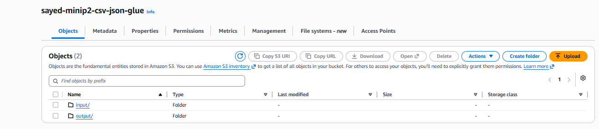
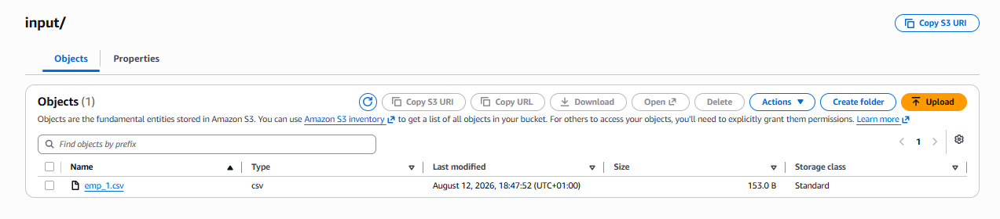
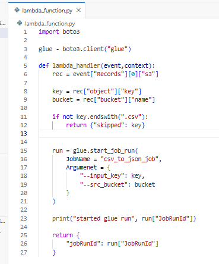
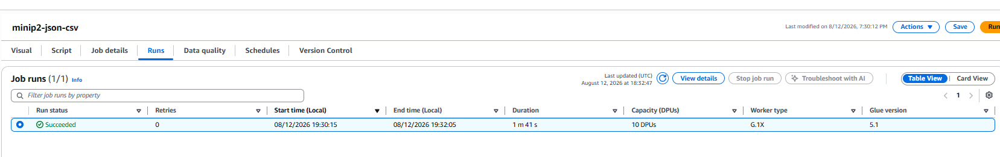
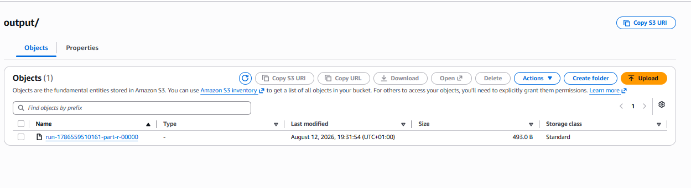
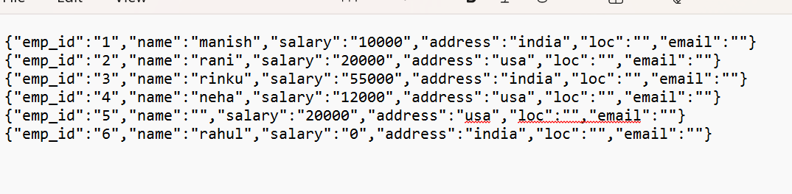

# AWS S3 → Lambda → Glue CSV to JSON ETL Pipeline

## Project Overview

This mini project demonstrates an event-driven ETL pipeline using AWS services.

The purpose of the project is to automatically process a CSV file uploaded to Amazon S3. When a CSV file is uploaded to the input folder, an S3 event triggers an AWS Lambda function. The Lambda function then starts an AWS Glue ETL job, which reads the CSV file and converts the data into JSON format. The transformed JSON data is finally stored in the S3 output folder.

## Architecture

```text
CSV File
   ↓
Amazon S3 - input/
   ↓
S3 ObjectCreated Event
   ↓
AWS Lambda
   ↓
AWS Glue ETL Job
   ↓
CSV → JSON Transformation
   ↓
Amazon S3 - output/
```

## AWS Services Used

* **Amazon S3** – Stores the source CSV file and transformed JSON output.
* **AWS Lambda** – Automatically triggers the AWS Glue job when a CSV file is uploaded.
* **AWS Glue** – Performs the ETL process and converts CSV data into JSON.
* **AWS IAM** – Provides the required permissions for Lambda, Glue and S3.
* **Amazon CloudWatch** – Provides logs for monitoring the Lambda function and Glue execution.

## S3 Structure

```text
sayed-minip2-csv-json-glue/
│
├── input/
│   └── emp_1.csv
│
└── output/
    └── JSON output file
```

The `input/` folder contains the source CSV file, while the `output/` folder stores the JSON data generated by AWS Glue.

## Project Workflow

### 1. Source Data Upload

The employee CSV dataset (`emp_1.csv`) is uploaded to the `input/` folder of the Amazon S3 bucket.





### 2. AWS Lambda Trigger

An S3 `ObjectCreated` event is configured on the `input/` folder.

When a `.csv` file is uploaded, Amazon S3 automatically invokes the Lambda function.

The Lambda function checks that the uploaded object is a CSV file and then starts the AWS Glue job using `glue.start_job_run()`.



### 3. AWS Glue ETL

The AWS Glue job reads the CSV source data from:

```text
s3://sayed-minip2-csv-json-glue/input/
```

The output format is configured as **JSON**, with the transformed data written to:

```text
s3://sayed-minip2-csv-json-glue/output/
```

### 4. Successful Glue Job

The AWS Glue job completed successfully, confirming that the ETL transformation was executed.



### 5. JSON Output

After the Glue job completed, a new output file was generated in the S3 `output/` folder.



The final output confirms that the original CSV employee records were successfully converted into JSON format.



## Lambda Logic

The Lambda function performs the orchestration part of the pipeline rather than the ETL transformation itself.

Its main responsibilities are:

1. Receive the S3 event.
2. Retrieve the uploaded object's bucket and key.
3. Check whether the uploaded file ends with `.csv`.
4. Start the `csv_to_json_job` AWS Glue job.
5. Return the Glue Job Run ID.

The Lambda source code used in this project is available in:

```text
lambda/lambda_function.py
```

## Repository Structure

```text
aws-s3-lambda-glue-csv-to-json-(mini-project2)/
│
├── README.md
│
├── lambda/
│   └── lambda_function.py
│
├── sample-data/
│   ├── README.md
│   └── emp_1.csv
│
└── screenshots/
    ├── README.md
    ├── 01-input-output-folders.png
    ├── 02-source-file.png
    ├── 03-lambda-function.png
    ├── 04-glue-job-succeeded.png
    ├── 05-output-file.png
    └── 06-result-JSON.png
```

## Key Learning Outcomes

Through this project, I gained practical experience with:

* Creating and managing Amazon S3 buckets and folders.
* Configuring S3 event notifications.
* Creating IAM roles and permissions for AWS services.
* Developing an AWS Lambda function using Python and Boto3.
* Triggering an AWS Glue job from Lambda.
* Building an AWS Glue ETL pipeline.
* Reading CSV data from Amazon S3.
* Transforming CSV data into JSON.
* Writing transformed data back to Amazon S3.
* Building an event-driven AWS data pipeline.

## Result

The end-to-end pipeline was successfully implemented.

When a CSV file is uploaded to the S3 `input/` folder, the process automatically triggers Lambda, starts the AWS Glue ETL job, converts the CSV data to JSON, and stores the transformed output in the S3 `output/` folder.

**Final Pipeline:**

**Amazon S3 → AWS Lambda → AWS Glue → Amazon S3**
